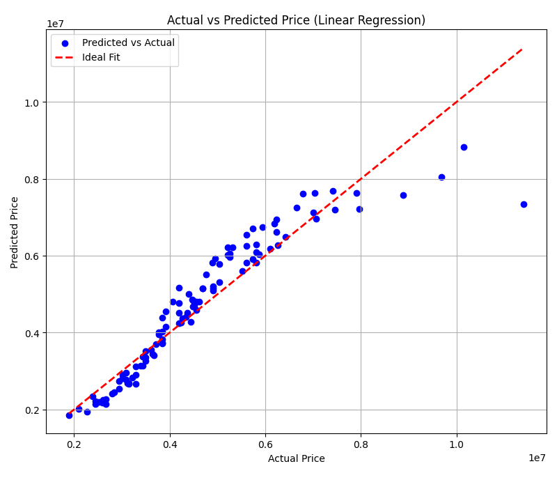

# Linear Regression

This repository contains a basic implementation of Linear Regression from scratch using Python and NumPy. The project demonstrates how the Normal Equation is used to fit a linear model to training data without relying on external machine learning libraries.

## Contents

- `LinearModel.py` — Contains the LinearRegression class with `fit()` and `predict()` methods.
- `Run.py` — Loads training and test data from CSV files and runs the model.
- `train.csv` & `test.csv` — Sample datasets used for training and evaluation.

## 📊 Visualization

The script also includes a simple plot of the training data along with the fitted regression line (for single feature inputs only):



> `output.png` is saved automatically when you run the code.

## 📦 Requirements

- Python 3
- NumPy
- pandas
- matplotlib (for visualization)

Install using:

```bash
pip install numpy pandas matplotlib
🚀 How to Run
bash
Copy
Edit
python Run.py
```
This will:

Load training and testing data from CSV files

Fit a linear model

Predict outputs on test data

Plot the regression line over training data (if one feature)

🧠 What You’ll Learn
How to implement linear regression from scratch using the Normal Equation

Basics of matrix operations with NumPy

Plotting data and model predictions using Matplotlib

✅ Sample Output
text
Copy
Edit
Predictions on test set:
[42.56 48.13 53.70 ...]
📌 To Do
Add gradient descent version

Add support for multi-feature visualization

Include evaluation metrics like MSE and R² Score

👤 Author
Soutik Mukherjee
Beginner in ML and Python, exploring core concepts.
